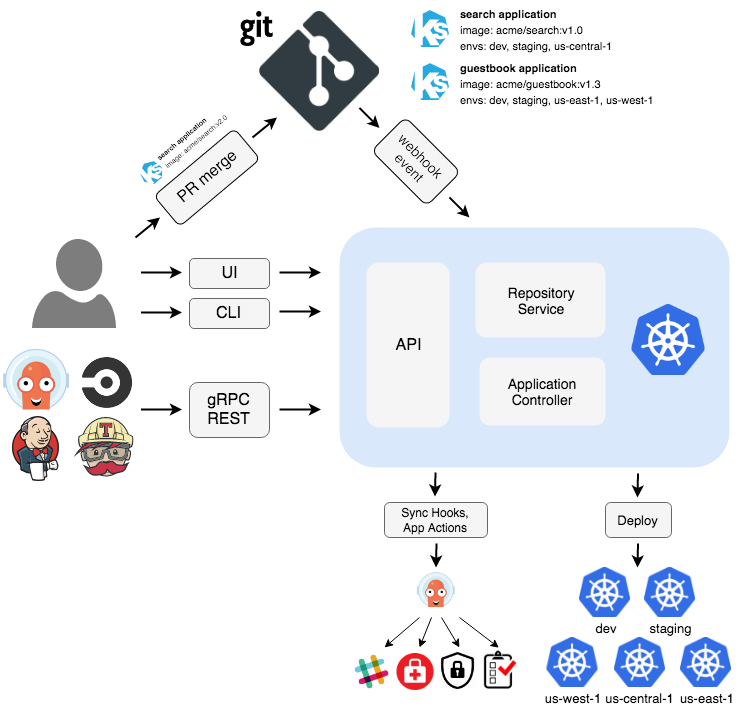

# 1 功能架构
从功能架构来看，Argo CD 主要有三个组件：API Server、Repository Server 和 Application Controller。从 GitOps 工作流的角度来看，总共分为 3 个阶段：检索、调谐和呈现。





## 1.1 检索 – Repository Server 

检索阶段会克隆应用声明式配置清单所在的 Git 仓库，并将其缓存到本地存储。包含 Kubernetes 原生的配置清单、Helm Chart 以及 Kustomize 配置清单。履行这些职责的组件就是 Repository Server。


Repository Server 是一个内部服务，它负责保存应用程序 Git 仓库的本地缓存，并负责生成和返回可供 Kubernetes 使用的 manifests，它接受的输入信息主要有以下内容：
- 仓库地址（URL）
- revision（commit, tag, branch）
- 应用程序路径
- 模板的特定设置：比如 helm values.yaml 等


## 1.2 调谐 – Application Controller
Application Controller 是一个 Kubernetes controller，它持续监听正在运行的应用程序并将当前的实时状态与所需的目标状态（如 repo 中指定的）进行比较。它检测 OutOfSync 应用程序状态并有选择地采取纠正措施。它负责为生命周期事件（PreSync、Sync、PostSync）调用任何用户定义的 hooks。

调谐（Reconcile）阶段是最复杂的，这个阶段会将 Repository Server 获得的配置清单与反映集群当前状态的实时配置清单进行对比，一旦检测到应用处于 OutOfSync 状态，Application Controller 就会采取修正措施，使集群的实际状态与期望状态保持一致。

## 1.3 呈现 – API Server


Argo CD 的 API Server 是一个 gRPC/REST server，它公开 Web UI、CLI 以及一些其他场景需要用到的 API。
最后一个阶段是呈现阶段，由 Argo CD 的 API Server 负责，它本质上是一个 gRPC/REST Server，提供了一个无状态的可视化界面，用于展示调谐阶段的结果。同时还提供了以下这些功能：

    应用管理和状态报告；
    调用与应用相关的操作（例如同步、回滚、以及用户自定义的操作）；
    Git 仓库与集群凭证管理（以 Kubernetes Secret 的形式存储）；repository 和集群 credential 管理（存 K8s secrets）；
    为外部身份验证组件提供身份验证和授权委托；
    RBAC 增强；RBAC（Role-based access control 基于角色的访问控制）；
    Git Webhook 事件的监听器/转发器。Git webhook 事件的 listener/forwarder；


# 2 argocd 的5个 pod

https://blog.csdn.net/u010039418/article/details/128009407
```
$ kubectl get po -n argocd
NAME                                 READY   STATUS    RESTARTS   AGE
argocd-application-controller-0      1/1     Running   0          19h
argocd-dex-server-767fb49f59-7rxn7   1/1     Running   0          19h
argocd-redis-65d6b6b4ff-29g6v        1/1     Running   0          19h
argocd-repo-server-67bf4499f-qnjwd   1/1     Running   0          19h
argocd-server-5c47bf87d-2dbbw        1/1     Running   0          19h

```

1.argocd-server:
提供 ArgoCD 服务的主要组件，是一个 gRPC/REST 服务器，提供 Web UI、CLI 和 CI/CD 系统所需的 API。它通过 API 与客户端通信，并处理来自 Git 存储库的声明性配置。argocd-server 还负责与 Kubernetes API 服务器通信，以将声明的状态与实际状态保持同步。

2. argocd-repo-server:
用于在 ArgoCD 中提供 Git 存储库的服务，负责维护 Git 仓库的本地缓存，其中保存着应用程序清单。它允许 ArgoCD 通过 HTTP 或 HTTPS 访问存储库，并从中读取或生成 Kubernetes 资源的声明性配置。

3. argocd-application-controller:
负责应用资源的状态同步。它是一个 Kubernetes 控制器，持续监视运行中的应用程序，并将当前实际状态与期望的目标状态（在仓库中指定）进行比较。当它检测到不符合预期的应用程序状态，会调用 Kubernetes API 以创建、更新或删除资源，以确保它们与声明的状态保持一致。同时它还负责调用用户定义的钩子以进行生命周期事件（PreSync、Sync、PostSync）的管理。

4. argocd-dex-server:
负责处理用户身份验证和授权。ArgoCD 使用 Dex 进行身份验证，可以集成多种身份提供者（如 GitHub、LDAP 等）。argocd-dex-server 管理用户和团队的身份，并生成用于与 argocd-server 通信的令牌。


5. argocd-redis:
用于缓存和存储 ArgoCD 的状态信息。由于 argocd-server 可能会频繁地与 Kubernetes API 服务器通信，使用缓存可以提高性能并减轻对 API 服务器的负载。


