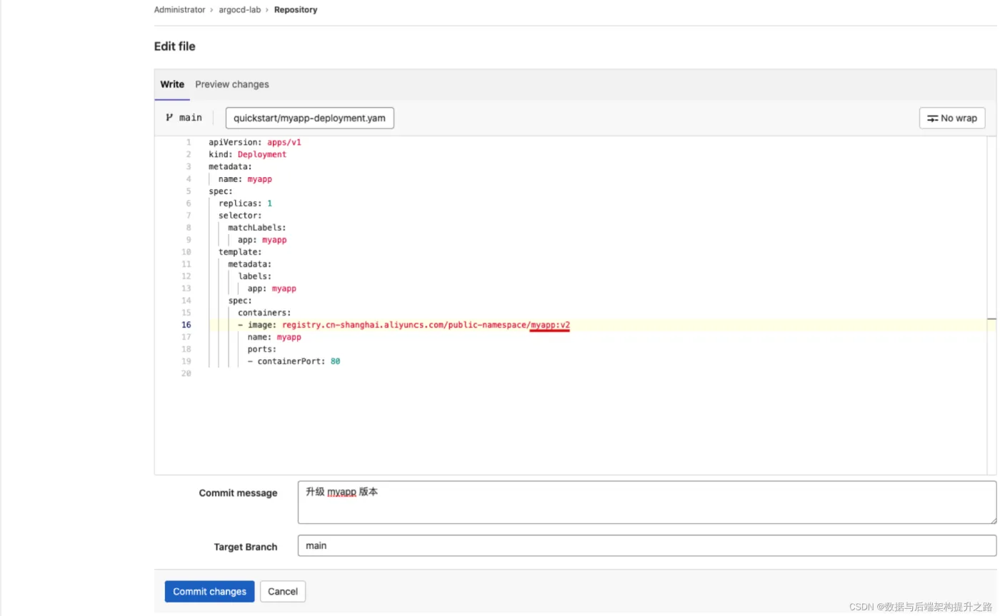
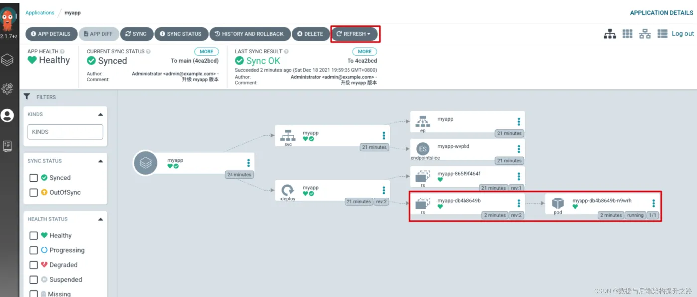
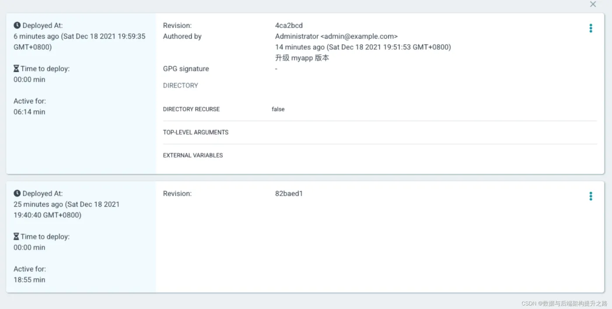
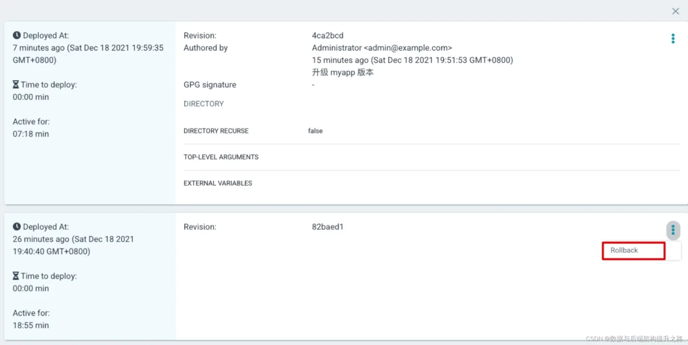
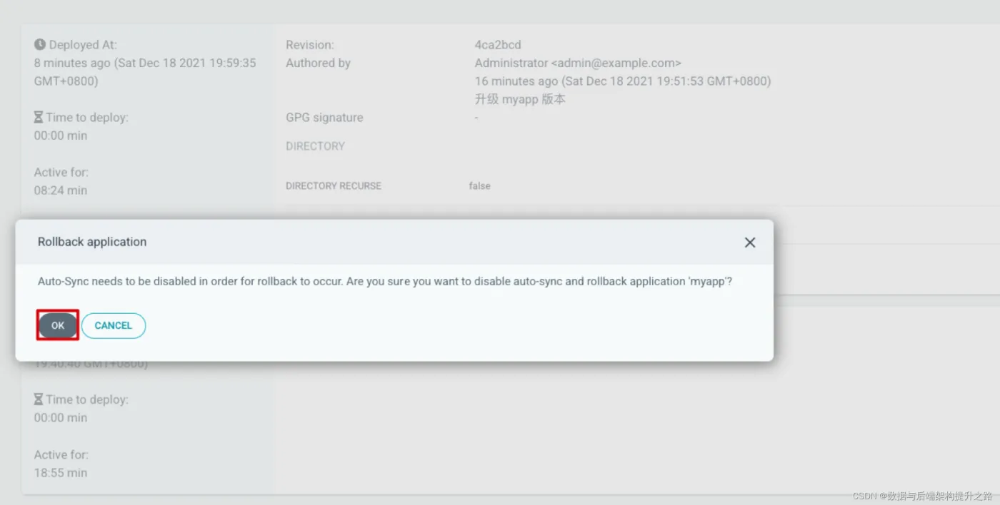
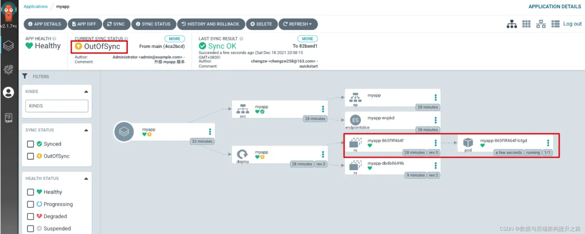

https://developer.aliyun.com/article/1319182

# 1 版本升级

将 myapp 应用从手动同步改成自动同步。点击 APP DETAILS -> SYNC POLICY，点击 ENABLE AUTO- SYNC

编辑 myapp 资源文件，将版本从 v1 改为 v2，点击 Commit changes，提交更改：

等待一会 Argo CD 会自动更新应用，如果等不及可以点击 Refresh，Argo CD 会去立即获取最新的资源 文件。可以看到此时 myapp Deployment 会新创建 v2 版本的 Replicaset，v2 版本的 Replicaset 会创 建并管理 v2 版本的 Pod。

# 2 版本回滚
升级到 v2 版本以后， v1 版本的 Replicaset 并没有被删除，而是继续保留，这是为了方便我们回滚应 用。在 myapp 应用中点击 HISTORY AND ROLLBACK 查看历史记录，可以看到有 2 个历史记录：

假设刚刚上线的 v2 版本出现了问题，需要回滚回 v1 版本，那么可以选中 v1 版本，然后点击 Rollback 进行回滚：

在回滚的时候需要禁用 AUTO-SYNC 自动同步，点击 OK 确认即可：

到此时已经回滚成功，此时 Pod 是 v1 版本的，并且由于此时线上的版本并不是 Git 仓 库中最新的版本，因此此时同步状态是 OutOfSync

